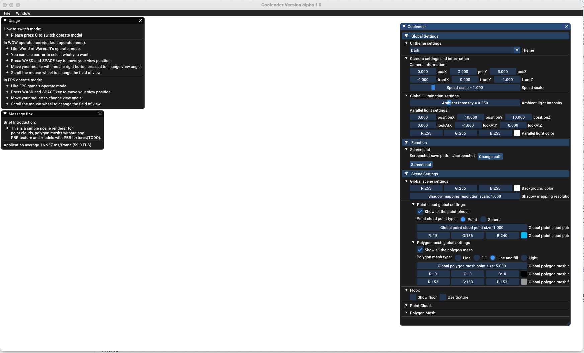
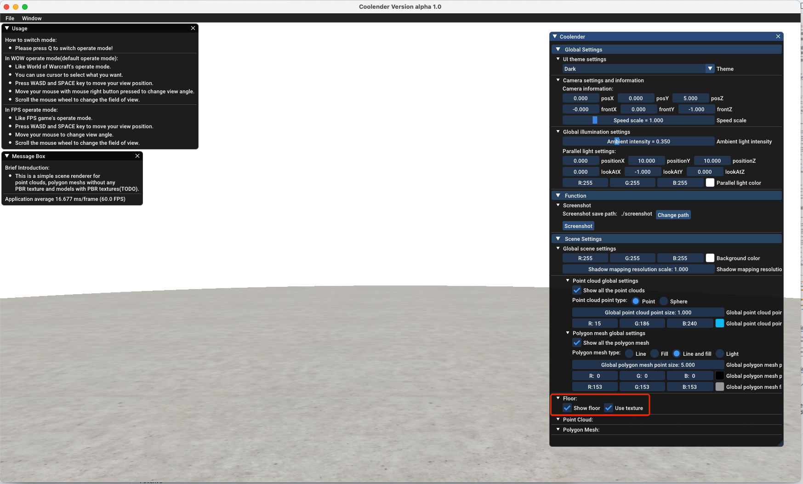
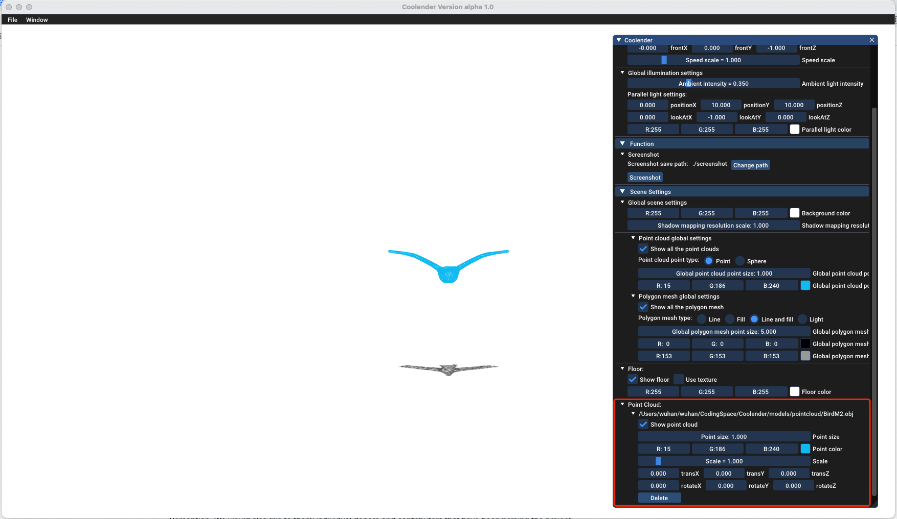
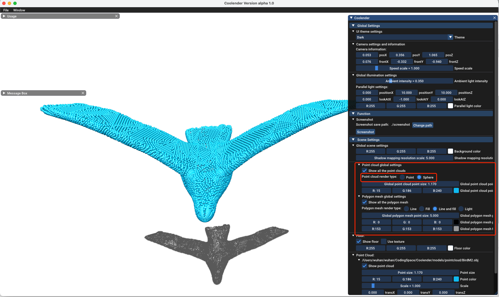
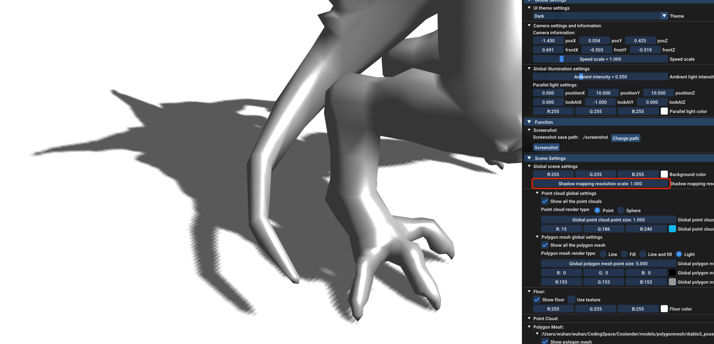

# Coolender


## 1.Introduction

This is a simple scene renderer for point clouds, polygon meshes without any PBR texture and models with PBR textures(TODO) on maxOS(Windows version will be online soon).

## 2.Getting start

On masOS the you can start Coolender with `starter.command` in the root directory or use terminal as follow:

```shell
cd path_to_Coolender_directory
./Coolender
```

PS: Maybe there's a warning "It's from an unidentified developer "on macOS, the solution is:https://support.apple.com/guide/mac-help/open-a-mac-app-from-an-unidentified-developer-mh40616/mac.

If Coolender run successfully, you will see the following GUI:



At first, there is nothing in the scene, so it's blank on the screen, but you can turn on the display floor switch with texture as follow. There is a floor in the scene.



## 3.Operate mode

After show the floor, it's easy to adjust the camera position. 

There are two operate modes in Coolender with pressing <kbd>Q</kbd> to switch.

* World of Warcraft style operate mode(default operate mode).
* FPS games style operate mode.

### 3.1 World of Warcraft style operate mode

In World of Warcraft style operate mode, you can press <kbd>W</kbd><kbd>S</kbd><kbd>D</kbd> and <kbd>SPACE</kbd>to move your view postion. Move your mouse **with mouse right button pressed** to change view angle. Scroll the mouse wheel to change the field of view.

### 3.2 FPS games style operate mode

There is another operate mode like FPS games. You can switch to the FPS style mode with pressing <kbd>Q</kbd> in World of Warcraft style operate mode.

In FPS games style operate mode, press <kbd>W</kbd><kbd>S</kbd><kbd>D</kbd> and <kbd>SPACE</kbd>to move your view postion. Move your mouse to change view angle and scroll the mouse wheel to change the field of view.

## 4.Import model

Coolender divide the displayable models into 3 categories such as point cloud only has vertex information, polygon mesh has vertex , normals and faces information, model not only has has vertex , normals and faces information but also with PBR textures(TODO).

PS:  Now Coolender can only import `.obj` format models, if you want use another format like `.ply`, `.fbx`, et al. it's better to convert  to `.obj` format. We list some ways to convert to `.obj` format.

* Use [Blender](https://www.blender.org/download/).
* Use [PCL](https://github.com/PointCloudLibrary/pcl).

### 4.1 Import point cloud

You can import point cloud models from the top menu as follow.


There's some point cloud models in `models/pointcloud` directory.

We import the `models/pointcloud/BirdM2.obj` as an example. After import a point cloud, you can see the information from the side bar. You can set some attributes like point size, color et al. of the point cloud in the side bar or delete point cloud from the scene.



### 4.2 Import polygon mesh

It's quite similar to import polygon mesh compere to importing point cloud from the top menu.

We import the `models/pointcloud/diablo3_pose.obj` as an example. And it's also the same to set some attributes like point cloud.


### 4.3 Import model with PBR textures

TODO...

## 5. Scene settings

Besides the attribute settings of a single model, Coolender can set some different render type in `Scene Settings` from side bar. 

### 5.1  Different render type for point cloud

For example, choose sphere render type for point cloud.



**PS: Although, we use instancing to render point cloud in sphere type, but it's still performance-consuming, if it's a large point cloud with too many points.**

### 5.2  Different render type for polygon mesh

Choose a lighting mode to render the polygon mesh.


## 6. Shadow settings

Dynamic shadow rendering is performance-consuming, especially render a super-resolution shadow mapping for improving shadow quality. Shadow mapping is turn on by default with floor rendering in Coolender, if it's not necessary to render the shadow, you can turn off the floor rendering.

If you want a good shadow rendering, you can adjust the shadow mapping resolution by increasing shadow mapping resolution scale. We use PCF (Percentage-Closer Filtering) to smooth the shadow edges, so if you  render a model from a distance, It’s not necessary to set shadow mapping resolution scale too heigh. 

Eg. Low shadow mapping resolution scale



Eg. Heigh shadow mapping resolution scale


## 7.Function

### 7.1 Screenshot

You can take a screenshot of the scene by click the `Screenshot` button in the side bar or use shortcut `LEFT CTRL`  + `P`. The screenshot will be stored in the screenshot directory under the root directory and will be named automatically. You can change the screenshot store directory as you like by clicking `Change path` in the side bar.

## 8.TODO

* Using PBR to render the model with PBR textures.
* Windows version.
* Skybox.
* Normals rendering.
* Defferred shading.
* SSAO

## 9.Appendix

### 9.1 Anti-aliasing

Coolender enables MSAA with 8 simples each pixel to anti-aliasing by default, but unfortunately, glfw does not support modifying the number of samples at runtime.

### 9.2 Third-party library

* [assimp](https://github.com/assimp/assimp)
* [glad](https://github.com/Dav1dde/glad)
* [glfw](https://github.com/glfw/glfw)
* [glm](https://github.com/g-truc/glm)
* [imgui](https://github.com/ocornut/imgui)
* [ImGuiFileDialog](https://github.com/aiekick/ImGuiFileDialog)
* [stb](https://github.com/nothings/stb)
* [whlib](https://github.com/whwuhan/whlib)

